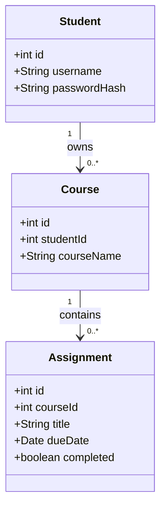

# College Assignment Tracker — UML Class Diagram

```mermaid
classDiagram
    class Student {
        +int id
        +String username
        +String passwordHash
    }

    class Course {
        +int id
        +int studentId
        +String courseName
    }

    class Assignment {
        +int id
        +int courseId
        +String title
        +Date dueDate
        +boolean completed
    }

    Student "1" --> "0..*" Course : owns
    Course "1" --> "0..*" Assignment : contains
```
